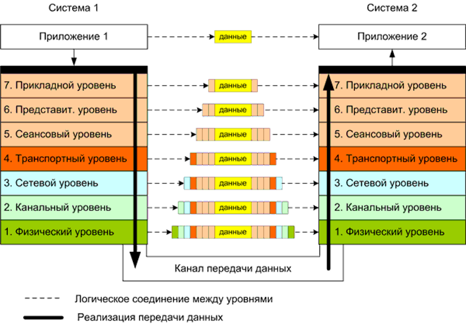

Передача данных по уровням модели OSI
#####################################

Рассмотрим процесс взаимодействия устройств по сети:

Как видим, при передаче какой-либо информации, передает данные по уровням модели OSI вниз, начиная с самого верзнего 7 и до 1 уровня

На каждом уровне сетевой модели данные обрастают какой-либо дополнительной информацией - заголовками.
На уровне приложения подразумевается, что само приложение добавит какой-то заголовок.

Часть сетевиков начинается с 4 уровня(L4) - транспортного

На этом уровне данные получают заголовк 4 уровня. Обычно это TCP или UDP заголовки. Так же данные на 4 уровне называются сегментами.

В заголовке L4 появляется адресация по порту - то есть адрес приложения в локальной системе.

После L4 данные передаются на уровень ниже - сетевой(L3). На сетевом уровне данные получают следующий заголовок - IP. В настоящее время это единственный протокол работающий
на L3 для взаимодействия различных узлов.
В заголовке L3 содержится IP адрес источника и адрес назначения. На L3 данные называеются - пакеты.

Следующий уровень - канальный(L2). на L2 данные называются - кадр. На этом уровне к данных добавляется заголовок L2 - чаще всего это протокол Ethernet и MAC-адреса.

После прохождения всех уровней данные передаются на первый уровень - физический(L1). Это уровень физической передачи сигнала. Может быть как медные/оптические провода, так и беспроводные среды

Как только даные со всеми заголовками приходят к получателю - заголовки начинают сниматься начаничая с 1 до 7 уровня снизу вверх. То есть происходит обратный процесс. В результате данные доходяд
до нужного узла и определенного приложения на нем.