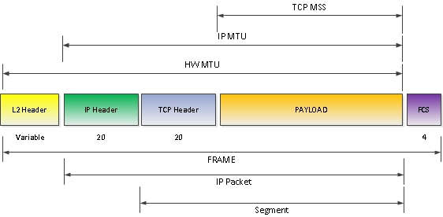
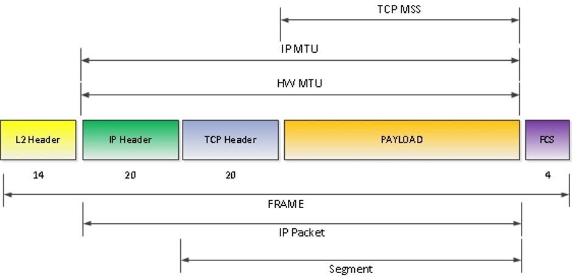

MTU
###

Как мы ранее видели, на каждом уровне к данным прибавляются дополнительные заголовки для раздичных видов адресации. То есть изначальные данные увеливаются при прохождении по сети.

В сети интернет заведено что максимальный размер данных передаваемых по сети со всеми заголовками должен равняться 1500 Байт. Это значение назывется MTU

MTU выбает нескольких видов:

Выше обозначены 3 вида MTU
  # TCP MSS - максимально возможный размер данных передаваемый с уровней приложения на транспортный уровень. То есть количество чистых данных, без каких либо заголовков
  # IP MTU - максимальный размер IP пакета. В это MTU включается размер полезных данных и заголовки L4. 1500 байт имееются ввиду как раз этот вид MTU
  # HW MTU - максимальный размер кадра. Сюда включается все заголовки с уровней выше и сами полезные данные.

Однако есть сложность с HW MTU. Разные операционные системы по разному понимают HW MTU.
Например Cisco iOS и iOS XE верна будет ситуции с этой схемы:

То есть L2 заголовок не включается в размер HW MTU. Это может привезти к некоторым проблемам в работе протокола маршрутизации OSPF и некоторых других технологий.

Чтобы настроить значение MTU на маршрутизаторе необходимо выполнить следующие действия:

.. code::
    R01(config)#interface gigabitEthernet 5/1
    R01(config-if)#mtu 1532
    R01(config-if)#exit

На коммутаторах значение MTU обычно настраивается для всей системы полностью, а не по интерфейсам, так же потребуется перезагрузка:

.. code::
    SW1(config)#system mtu 1532
    SW1(config)#exit
    SW1#reload

Проверить настройки MTU на маршрутизаторе:

.. code::
    R01#show interfaces gigabitEthernet 5/1
    GigabitEthernet5/1 is up, line protocol is up (connected)
      Hardware is C6k 1000Mb 802.3, address is 0008.e3ff.fde0 (bia 0008.e3ff.fde0)
      Description: -- --
      MTU 1532 bytes, BW 1000000 Kbit, DLY 10 usec,
        reliability 255/255, txload 82/255, rxload 20/255
    Encapsulation ARPA, loopback not set
    Keepalive set (10 sec)
    Full-duplex, 1000Mb/s, media type is LH
