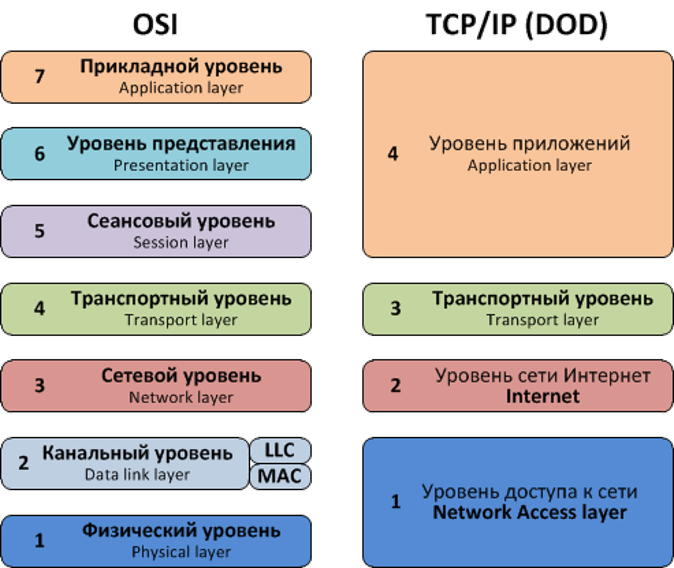

Модель OSI
##########

Так как изучение сетей начинается с модели OSI, то не будем исключением.

Модель OSI(open systems interconnection) состоит из 7 увроней:
  * Прикладной
  * Представления
  * Сеансовый
  * Транспортный
  * Сетевой
  * Канальный
  * Физический

Каждый такой уровень отвечает за свою задачу в передаче данныйх по сети.

Можедель OSI разрабатывалась как базовая эталонная модель. Но в реальности все работает не совсем так.
На данный момент более актуальной моделью считается - TCP/IP

Модель TCP/IP так же состоит из уровней взаимодействия, однако тут их 4:
  * Приложение
  * Транспортный
  * интернет
  * доступ к сети

Сравнение моделей:

Модель OSI служит для понимания, как именно должен работать процесс взаимодействия устройств по через сеть.
С ее помощью удобно начинать поиск и устранение неисправностей.

