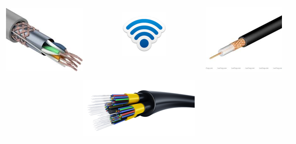

L1 Модели OSI
#############

Первый уровень модели OSI - физический

К этому уровню относятся среды передачи данных и протоколы работающие на них. То есть этот уровень определяет как именно будут доставлены данные - провода(медные или оптические)
или беспроводные сети(Wi-Fi, GSM, спутниковые сети)

