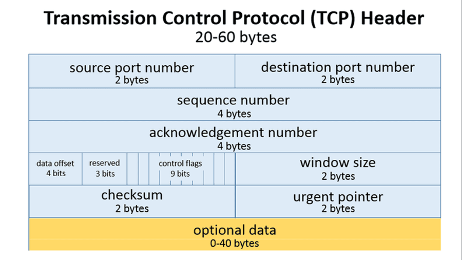
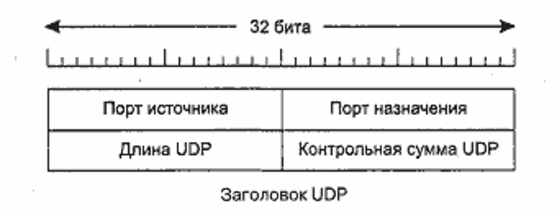

L4 Модели OSI
#############

Транспортный уровень модели OSI работает с сегментами данных. На этом уровне появлется адресация - порт. Данный уровень отвечает за направление данных к определенному приложению внутри системы.
На это уровне работаю два оснонвых протокола
   * TCP_
   * UDP_

TCP
~~~
Протокол TCP отвечает за гарантированную доставку сообщений от одной системы к другой в той же последоватально, какой данные были отправлены изначально.

Чтобы добиться гарантированной доставки, TCP открывает сессию между источником и назначением в три шага, в которых согласоются параметры передачи данных. При этом на каждое отправленное сообщение
должно придти подтверждение, что сообщение получено.

Формат заголовка TCP включает большое количество параметров для поддержания соединения и управления сессией:

Из за своих особенностей протокол TCP отлично подходит для случаев, когда надо передать какие-либо файлы без потерь, изменений и не точностей.

UDP
~~~

Проктол UPD же работает намного проще. Он не устанавлиает сессию и не следит, что данные точно были доставлены. По сути UDP обеспечивает только скорость доставки, так как нет подтверждений и дополнительной
служебной информации.

Формат заголовка UDP тоже очень прост:

UDP отлично подходит для использования в передачи голоса или видео. Так как этих сферах будет не критично потерять пару пакетов. А задержка и переотправка данных как в TCP может быть критична.

Сравнить TCP и UDP можно одной картинкой:

