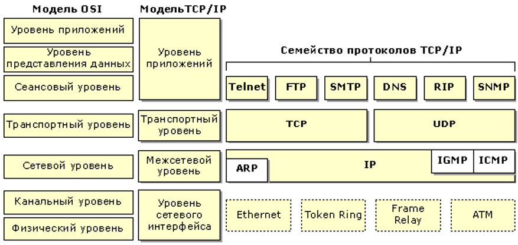

Протоколы по уровнял можели OSI
###############################

Принято считать. что каждый протокол относится к тому или иному уровню модели OSI(помним, что в реальности оно не всегда так)

Как видно на нижних уровнях работает достаточно много протоколов, но все они были вытеснены протоколом Ethernet.

Выше видим протокол IP на уровне L3. Там же находятся ICMP и IGMP - служебные протоколы для согласования различных параметров сети для дальнейшей передачи данных
На L3 так же находится протокол ARP - исключение. На самом деле он работает между L3 и L2 - служит для соотношения MAC адреса и IP.

На уровне L4 занимают местро протоколы TCP и UDP. На L4 бывают и другие протоколы, но они используются уже в более специфичных конфигурациях сети. Частый пример - VoIP
