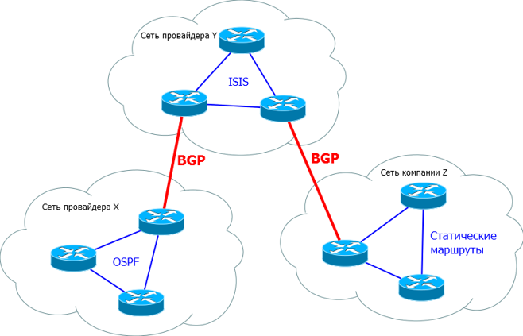
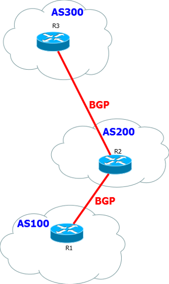

BGP
###

Существует два основных типов протоколов маршрутизации:
  * IGP - interior gateway protocol: ISIS/OSPF/RIP/EIGRP
  * EGP - exterior gateway protocol: BGP

BGP(Border Gateway Protocol) - основной протокол динмической маршрутизации, который используется в сети Интернет.

Как видим на картинке, BGP используется между различными локальными сетями. То есть это протокол уровня стыка провайдеров с провайдерами или конечными клиентами.

В самих же локальных сетях могут работать разные протоколы маршрутизации такие как OSPF или EIGRP. И даже статичные маршруты.

Основным разделением организаций в BGP служит автономная система - AS(Autonomous System)

AS(Autonomous System) - Система IP-сетей и маршрутизаторов, управляемых одним или несколькими операторами, имеющими единую политику маршрутизации.

Организация
~~~~~~~~~~~

Так как Интернет сеть достаточно большая то тут не обойтись и без своего рода контроля. В сети интернет контролируются IP адреса и автономные системы.

Таким контролем занимается международный институт - IANA.

Однако сам IANA не занимается выдачей и фиксированием адресного пространства в Интернете, поэтому все задачи делегированы так называемым RIR(Regional Internet Registry), которые отвечаеют за определенные регионы.

В мире всего 5 RIR:
  * RIPE - Европа и Ближнтй Восток
  * ARIN - Северная Америка
  * APNIC - Азия и Тихий Океан
  * LANIC - Латинская Америка
  * AfriNIC - Африка

Обязанности RIR:
  * Выделением адресного пространства
  * Регистрацией LIR
  * Статистикой
  * Разрешением споров

При всех этих обязанастях RIR ничего не продает и не покупает.

RIR на данный момент невозможно.
Однако можно стать LIR - Local Internet Registry

LIR - провайдер или крупная организация. Так же могут распределять адресное простанство полученное от RIR, но в локальных регионах. За право быть LIR предусмотрены членские взносы

Членские взносы расчитываются из размеров сети и выделяют 5 категорий:

  * Extra Large (В России 3)
  * Large (В России 20шт)
  * Medium
  * Small
  * Extra Small

Чтобы стать LIR необходимо иметь хотя бы один 1 автономной системы(ASN) и 4096 IP адресов.

Права LIR:
  * Выделение или продажа ASN и IP/PI адресов
  * Выделение PA адресов
  * Посредничество в работе с RIR(RIPE) – регистрация ASN/PI/LIR
