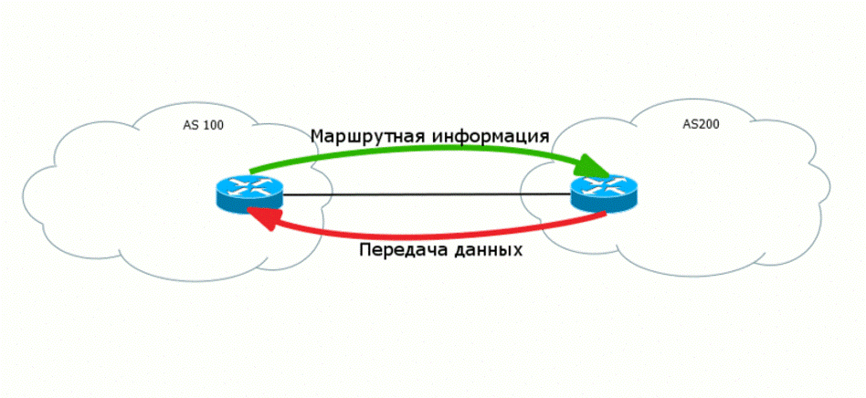

Выбор пути
##########

Для начала определимся в какую сторону что уходит и приходит. Для понимания этого процесса есть два определения:

  1. Control plane -  управляющий уровень, работа служебных протоколов, обеспечивающих условия для передачи данных.
  2. Data plane - передающий уровень, передача полезных данных клиентов.

