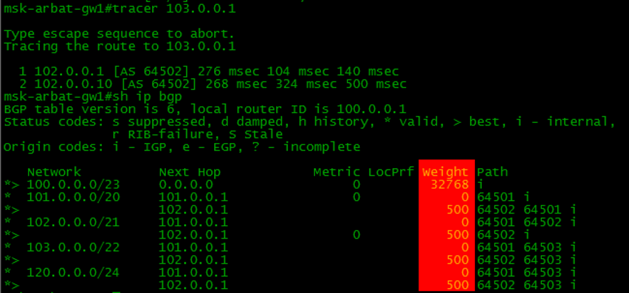

Распределение и балансирование трафика
--------------------------------------
Понятия распределение и балансировка в аспектах протокола BGP не устоялись. Однако перенося определения из двругих областей можно обозначить:

  * Балансировка - распределение трафика между несколькими линками до одной сети
  * Распределение - распределение трафика с учетом приоритезации трафика до одной сети

Балансировка
~~~~~~~~~~~~

.. image:: ../img/bgp/ls.png
       :width: 50 %
       :align: center

Балансировка трафика возможно при выполнении нескольких условий:

  1. Не менее двух маршрутов в таблице BGP для этой сети.
  2. Оба маршрута идут через одного провайдера
  #. Параметры Weight, Local Preference, AS-Path, Origin, MED, метрика IGP совпадают.
  #. Параметр Next Hop разный для двух маршрутов

Настроить балансировку можно командой в режиме конфигурации BGP:

::

  router bgp 100
    maximum-paths 2

Остается один нюанс - может быть несколько маршрутов через один Next-Hop. Обойти это ограничение можно скрытой командой:

::

  bgp bestpath as-path multipath-relax

Так же при включении этого режима игнорируется условие полного совпадения AS-Path, но длина пути все еще должна быть одинаковой.

Для балансировки трафика можно учитывать еще и пропускную спость линков. Для этого необходимо:

::

  router bgp 100
    bgp dmzlink-bw
    neighbor <neighbor> dmzlink-bw
    neighbor <neighbor>

То есть включаем глобально для процесса BGP мониторинг параметра bandwidth. А потом отдельно для каждого соседа, для которого надо учитывать этот параметр.

Распределение нагрузки - исходящий трафик
~~~~~~~~~~~~~~~~~~~~~~~~~~~~~~~~~~~~~~~~~

Для распределения исходящего трафика используется несколько атрибутов протокола BGP:

  * Weight – cisco параметр. У разных вендоров есть свои аналогии
  * Local Preference – cтандартный атрибут. По умолчении 100 для всех маршрутов

Атриубуты Weight и Local Preference можно увидеть вызвав команду

::

  show ip bgp

Крысным выделен атриубут Weight. По умолчанию его значение равно 32768. При этом, чем меньше значение тем приоритетнее маршрут до какой-либо сети

Атрибут Local Preference по-умолчанию равен 100. Однако для соседей eBGP он не отображается, если он не настроен вручную.
Чем Выше значение атрибута Local Preference, тем приоритетнее маршрут

Распределение нагрузки - входящий трафик
~~~~~~~~~~~~~~~~~~~~~~~~~~~~~~~~~~~~~~~~

Более интересный способ управления трафиком. То есть есть возможность управлять трафиком на стороне провайдера. Для этого есть несколько атрибутов:

  * AS-Path – стандартны и самый частый прием удлинения маршрута
  * MED(cisco Inter-AS метрика) – очень слабый атрибут и почти никогда не используется
  * Разные сети разным провайдерам
  * BGP Community

По атрибуты расказано в отдеьной главе по `атрибутам`_

.. _`атрибутам`: /book/091_bgp/attr.html

Интересный момент при использовании способа 3 - разные сети разным провайдерам.

Смысл способа заключается в следующем, при выполнение одного условия - анонсируемая сеть должна быть не меньше /23

Если сеть по размеру больше или равна /23:

  1. Разделить сеть на 2(при использовании с 2 провайдерами) /24
  2. Анонсировать /24 сети провайдерам. При этом одному провайдеру только одну /24 сеть. Второму провайдеру другую /24 сеть
  #. Помнить, что сеть будет анонсирована только если она есть в таблице маршрутизации(RIB-таблица)
  #. Дополнительно ко всему необходимо анонсировать и большую /23 сеть. Надо это за тем, что при паданеии одного провайдера, трафик из сети /24, которая анонсировалась только ему, проходил через другого провайдера
  #. Дополнительные маршруты можно добавить командой:

::

  ip route 100.0.0.0 255.255.254.0 Null0
  ip route 100.0.0.0 255.255.255.0 Null0
  ip route 100.0.1.0 255.255.255.0 Null0

Как видно, надо задать все 3 сети - 2 сети /24 и 1 сеть /23

При таком использовании получается следующая ситуация:

.. image:: ../img/bgp/ipsip.png
       :width: 100 %
       :align: center