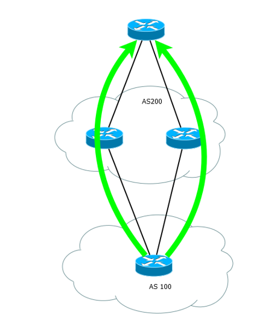

Распределение и балансирование трафика
--------------------------------------
Понятия распределение и балансировка в аспектах протокола BGP не устоялись. Однако перенося определения из двругих областей можно обозначить:

  * Балансировка - распределение трафика между несколькими линками до одной сети
  * Распределение - распределение трафика с учетом приоритезации трафика до одной сети

Балансировка
~~~~~~~~~~~~

Балансировка трафика возможно при выполнении нескольких условий:

  1. Не менее двух маршрутов в таблице BGP для этой сети.
  2. Оба маршрута идут через одного провайдера
  #. Параметры Weight, Local Preference, AS-Path, Origin, MED, метрика IGP совпадают.
  #. Параметр Next Hop разный для двух маршрутов

Настроить балансировку можно командой в режиме конфигурации BGP:

::

  router bgp 100
    maximum-paths 2

Остается один нюанс - может быть несколько маршрутов через один Next-Hop. Обойти это ограничение можно скрытой командой:

::

  bgp bestpath as-path multipath-relax

Так же при включении этого режима игнорируется условие полного совпадения AS-Path, но длина пути все еще должна быть одинаковой.

Для балансировки трафика можно учитывать еще и пропускную спость линков. Для этого необходимо:

::

  router bgp 100
    bgp dmzlink-bw
    neighbor <neighbor> dmzlink-bw
    neighbor <neighbor>

То есть включаем глобально для процесса BGP мониторинг параметра bandwidth. А потом отдельно для каждого соседа, для которого надо учитывать этот параметр.

Распределение нагрузки - исходящий трафик
~~~~~~~~~~~~~~~~~~~~~~~~~~~~~~~~~~~~~~~~~

