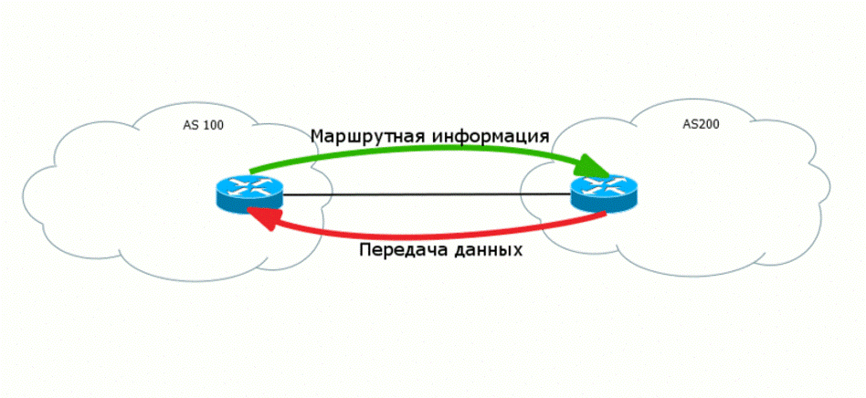
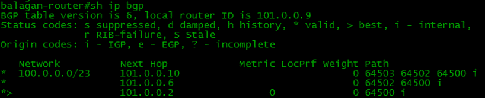
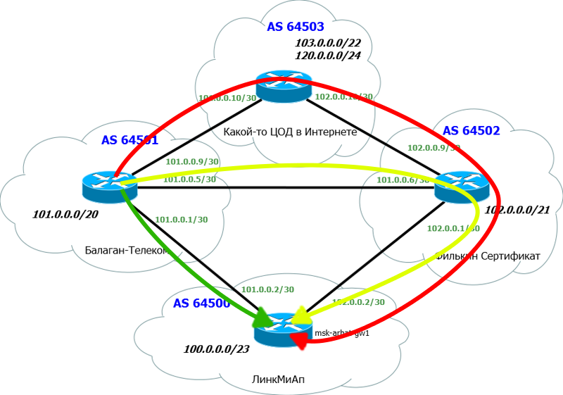
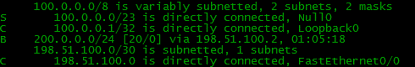

Выбор пути
~~~~~~~~~~

Для начала определимся в какую сторону что уходит и приходит. Для понимания этого процесса есть два определения:

  1. Control plane -  управляющий уровень, работа служебных протоколов, обеспечивающих условия для передачи данных.
  2. Data plane - передающий уровень, передача полезных данных клиентов.

Сначала разбемся что мы знаем вообще о сетях, которые получаем через UPDATE BGP.

Вся информация из UPDATE хранится в талице FIB

В результате мы имеем множество маршрутов до одного узла в сети, как показано на рисунке ниже

Однако трафик идет только по лучшему маршруту, который мы получаем через UPDATE. Лучший маршрут попадает в таблицу общую таблицу маршрутизации RIB

Критерии выбора лучше маршрута
~~~~~~~~~~~~~~~~~~~~~~~~~~~~~~

  1. Максимальное значение Weight (локально для маршрутизатора, только для Cisco)
  2. Локальный маршрут маршрутизатора (next hop = 0.0.0.0)
  #. Максимальное значение Local Preference (для всей AS)
  #. Кратчайший путь через автономные системы. (самый короткий AS_PATH)
  #. Минимальное значение Origin Code (IGP<EGP<incomplete)
  #. Минимальное значение MED (распространяется между автономными системами)
  #. Путь eBGP лучше чем путь iBGP
  #. Выбрать путь через ближайшего IGP-соседа, если это условие выполнено, то происходит балансировка нагрузки между несколькими равнозначными линками
  #. Выбрать самый старый маршрут для eBGP-пути (может отличаться у разных вендоров)
  #. Выбрать путь через соседа с наименьшим BGP router ID (может отличаться у разных вендоров)
  #. Выбрать путь через соседа с наименьшим IP-адресом (может отличаться у разных вендоров)

