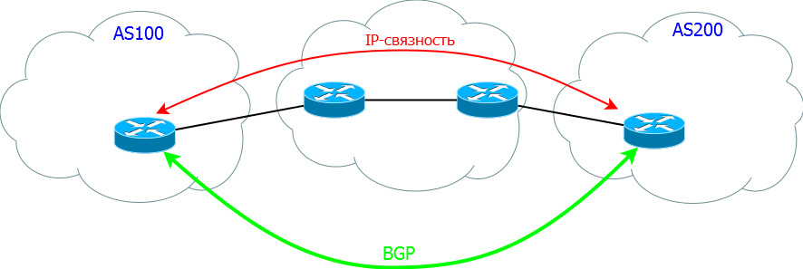

Состояния BGP
-------------

Протокол маршрутизации BGP поддерживает активное соединение поверх TCP со своими соседями.
Все соседи задаются вручную.

Состояний соседства 6:
  1. IDLE - изначальное состояние BGP-соседства. Ничего не происходит
  2. CONNECT – Слушает  порт 179, но ничего не отправляет
  #. ACTIVE – Отправил SYN и ждет ответ от соседа
  #. OPENSENT – BGP начал обмен сообщениями OPEN. Сообщение отправлено
  #. OPENCONFIRM – сообщение OPEN получено
  #. ESTABLISHED – все настройки согласованы и сессия BGP работает

Состояния OPENSENT и OPENCONFIRM увидеть практически невозможно, так как BGP на них не останавлиется.

Зачем может понадобиться работать поверх TCP?
А чтобы была возможна такая ситуация:

Виды сообщений BGP
~~~~~~~~~~~~~~~~~~

Сообщения BGP:

  * Open – согласование номера AS, Hold Timer и Router ID
  * NOTIFICATION – отправляются в случае каких-либо проблем, чтобы разорвать сессию
  * UPDATE – обмен маршрутной информацией
  * KEEPALIVIE - «Я всё ещё жив» (работает так же подтверждением что информация получена)
  * ROUTE REFRESH – позволяет запросить у своих соседей все маршруты заново без рестарта BGP процесса

Проблемы при установления соседства
~~~~~~~~~~~~~~~~~~~~~~~~~~~~~~~~~~~

Проблем может быть несколько.

Первый вариант - состяние соседом зависло в ACTIVE:

  * нет IP-связности между соседями
  * BGP не запущен на соседе
  * порт 179 закрыт ACL

Второй вариант - при согласовании OPEN сообщениями:

  * Используются разные версии протокола(маловероятно)
  * Настроены разные номера AS
  * Router ID совпадают

Как понять что проблема в сообщениях OPEN? очень просто - маршрутизатор проскакивает состояниие ACTIVE и возвращается в IDLE.
При любой проблеме в соодинении между соседями маршрутизаторы переходят в состоянии IDLE и начинают с самого начала установить соседство

Ни одной проблемы с таймеров, кстати, нет. А все потому что таймеры согласовываются автоматически через OPEN сообщения. Выбирается минимальный таймер указынный на обоих соседях
